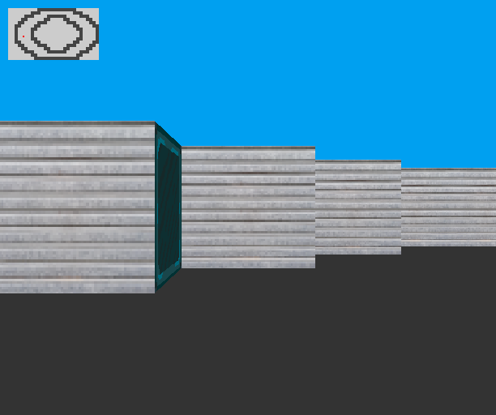

# Cub3d

  

3D raycasting engine in C inspired by Wolfenstein, built with MiniLibX.

## About This Project

### What It Does

Cub3d is a first-person 3D maze viewer rendered entirely with raycasting: for every vertical strip of the screen, it casts a ray from the player's position until it hits a wall, then draws a wall slice whose height and texture depend on the distance and the side that was hit.

The map, textures (per-cardinal-direction wall textures), floor/ceiling colors, and player start position/orientation are all read from a .cub scene file at startup, which is validated before rendering begins (closed map, valid characters, exactly one player). At runtime, the player can move and strafe with the keyboard and rotate the view with the mouse or arrow keys, with a small 2D minimap overlaid for orientation.

### Purpose

It evaluates the ability to implement a classic real-time rendering technique (raycasting, the same core idea behind Wolfenstein 3D) from first principles in C, combining geometry/trigonometry, file parsing with strict validation, and a game loop driven by a graphics library (MiniLibX) instead of a ready-made engine.

## Stack

- School: 42
- Primary language: C + MiniLibX
- Scope: one repository per project

## Skills Demonstrated

`Raycasting` | `Real-time rendering` | `Trigonometry/geometry` | `Strict file parsing` | `MiniLibX`

## Features

- Real-time 3D rendering via raycasting, with no external graphics engine
- Parser for .cub map files with validation of textures, floor/ceiling colors, and collisions
- Smooth camera movement and rotation with FPS control

## Review Focus

- Look for map validation before rendering: closed boundaries, valid characters, and exactly one player start.
- Review the raycasting loop, distance correction, texture selection, and collision behavior.
- Notice how low-level graphics, input handling, and geometry come together without a game engine.

## Project Deep Dive

Cub3d is a graphics project that makes rendering visible from first principles. The program turns a 2D map into a first-person 3D view by casting rays, measuring wall distances, selecting textures, and drawing vertical slices on screen.

The project is also a parser and validation exercise. Before rendering, the .cub file must describe a valid world: textures, colors, map layout, allowed characters, and a single player start. That makes the visual output depend on both math and robust input validation.

## Implementation Notes

- Uses raycasting instead of a 3D engine, so projection and distance correction are implemented directly.
- Validates map closure and player state before starting the game loop.
- Combines keyboard/mouse input, collision checks, texture sampling, and minimap rendering.

## Screenshots

*Raycasting output in motion: textured walls, player navigation, and the in-game view rendered from the map.*

## How to Run

Prerequisites: `make`, a C compiler, and MiniLibX's dependencies (X11, Xext, and OpenGL/GLFW development libraries - MiniLibX itself is vendored under `lib/MLX42`).

~~~bash
make
./cub3D map.cub
~~~

## Testing

No dedicated testing scripts were detected at the project root.

## Notes

- This repository is part of the 42 portfolio.
- Commands are intended for local execution for review and evaluation.

## Author

anapaulapgavilan
